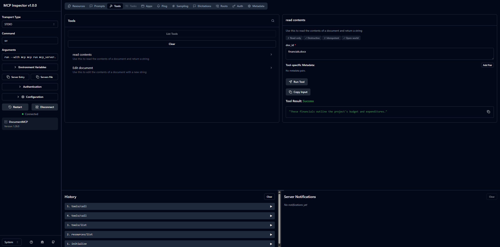

# MCP Chat

MCP Chat is a learning project that connects an OpenAI-powered command-line
chat application to a local MCP (Model Context Protocol) document server.

The project has two entrypoints:

- `main.py` starts the complete chat client.
- `mcp_server.py` starts only the document MCP server.

The `mcp` command is an MCP development CLI. It can run or inspect an MCP
server, but it does not replace ordinary shell commands such as `ls`, `python`,
or `uv`.

## How it works

```text
User
  |
  v
CLI (core/cli.py)
  |
  v
Chat orchestration (core/chat.py and core/cli_chat.py)
  |                         |
  |                         +--> OpenAI Responses API
  |
  +--> MCP client (mcp_client.py)
            |
            | STDIO
            v
      Document server (mcp_server.py)
            |
            +--> read_contents
            +--> edit_document
```

When `main.py` starts, it:

1. Loads `OPENAI_MODEL` and `OPENAI_API_KEY` from `.env`.
2. starts `mcp_server.py` as a child process;
3. connects to that server through MCP over standard input/output (STDIO);
4. starts the interactive terminal prompt;
5. sends user messages and available MCP tool definitions to OpenAI;
6. executes requested tools through the MCP client; and
7. returns tool results to OpenAI so it can produce the final answer.

The document server currently keeps its sample documents in memory. Changes
made with `edit_document` last only until the server process stops.

## Project structure

| Path | Purpose |
| --- | --- |
| `main.py` | Starts the complete interactive application |
| `mcp_server.py` | Defines the local `DocumentMCP` server and its tools |
| `mcp_client.py` | Manages the STDIO connection to MCP servers |
| `core/claude.py` | Contains `OpenAIService`; the filename is retained from the original lesson structure |
| `core/chat.py` | Runs the OpenAI response and tool-call loop |
| `core/cli_chat.py` | Adds document mentions and slash-command handling |
| `core/cli.py` | Implements the interactive terminal interface and completion |
| `core/tools.py` | Converts MCP tools to OpenAI function tools and executes calls |

## Prerequisites

- Python 3.10 or newer
- An OpenAI API key
- `uv`
- Node.js and npm if you want to use MCP Inspector

## Setup

From the `mcp` directory, create the environment and install the locked
dependencies:

```bash
uv sync
source .venv/bin/activate
```

On Windows PowerShell, activate it with:

```powershell
.venv\Scripts\Activate.ps1
```

Create or edit `.env`:

```env
OPENAI_MODEL="gpt-5.6-luna"
OPENAI_API_KEY="your-api-key"

# Use 1 to launch the built-in MCP server through uv.
# Use 0 to launch it with the active environment's Python executable.
USE_UV=1
```

You can replace the model with another OpenAI model that supports function
calling through the Responses API.

## Run the chat application

Start the complete application with:

```bash
uv run main.py
```

If the virtual environment is already active, this also works:

```bash
python main.py
```

Do not prefix these commands with `mcp`:

```text
uv run main.py       correct
python main.py       correct
mcp uv main.py       incorrect
mcp run main.py      incorrect: main.py is a client, not an MCP server
```

Press `Ctrl+C` to exit the chat.

## Run or inspect the MCP server

Run only the document server:

```bash
mcp run mcp_server.py
```

The command may appear to do nothing. That is expected: a STDIO MCP server
waits silently for an MCP client to send protocol messages.

Launch the server with MCP Inspector:

```bash
mcp dev mcp_server.py
```

The Inspector opens a browser interface where you can connect to the server,
list its capabilities, enter tool arguments, and inspect results.



In the screenshot, the Inspector is connected to `DocumentMCP` over STDIO. The
selected tool reads `financials.docx` and displays the returned document text.
The screenshot was captured before the tool identifiers were normalized for
OpenAI; the current names are `read_contents` and `edit_document`.

## Available server tools

### `read_contents`

Reads a document from the in-memory `docs` dictionary.

Example input:

```json
{
  "doc_id": "financials.docx"
}
```

### `edit_document`

Replaces an exact string inside a document.

Example input:

```json
{
  "doc_id": "plan.md",
  "old_str": "implementation",
  "new_str": "deployment"
}
```

The old string must match exactly, including whitespace.

## Current implementation status

The MCP server and its two tools can be exercised through MCP Inspector.

The following lesson exercises remain unfinished:

- returning tools and calling them in `mcp_client.py`;
- exposing document-list and document-content resources;
- exposing rewrite and summarize prompts; and
- parsing resources and prompts in the client.

Until the TODO methods in `mcp_client.py` are implemented, the complete chat
application can connect to the server but will not discover or execute its MCP
tools.

## Add another MCP server

Pass additional Python server files after `main.py`:

```bash
uv run main.py path/to/another_server.py
```

Each additional server is started with `uv run` and added to the set of MCP
clients available to the chat application.

## Troubleshooting

### `No such command 'uv'` from `mcp`

Run `uv` directly:

```bash
uv run main.py
```

`mcp uv main.py` is invalid because `uv` is not an `mcp` subcommand.

### `No such command 'ls'` from `mcp`

Use the shell command directly:

```bash
ls
```

The MCP CLI currently provides commands such as `mcp run`, `mcp dev`,
`mcp install`, and `mcp version`; it is not a shell.

### Missing OpenAI configuration

If startup reports that `OPENAI_MODEL` or `OPENAI_API_KEY` is empty, update
`.env` before running the application.

### Inspector does not open

Verify that Node.js and npm are installed:

```bash
node --version
npm --version
```

Then retry:

```bash
mcp dev mcp_server.py
```
